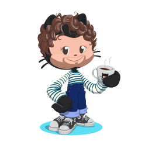

# Hi, I'm MrDoomy 👋

Passionate about IT science since many years. I have a **FullStack** software developer profile.

Indeed, I started to develop mobile applications in **Java** and **Kotlin** for **Android**.

When I discovered **NodeJS** and the **AngularJS** framework, I found myself a passion for Web development but especially for the **JavaScript** programming language.

**React**, **VueJS**, **TypeScript**, **MongoDB**, **ExpressJS**, **GraphQL**, **SCSS**... Are the technologies that I handle every day.
Today, I love designing and creating from A to Z (from APIs to graphical rendering) Web applications.

Aware of the time-consuming nature of the code, I aspire in the future to manage large-scale IT projects. In the meantime, I'm moving forward in my life with the head full of new ideas and innovative projects.
